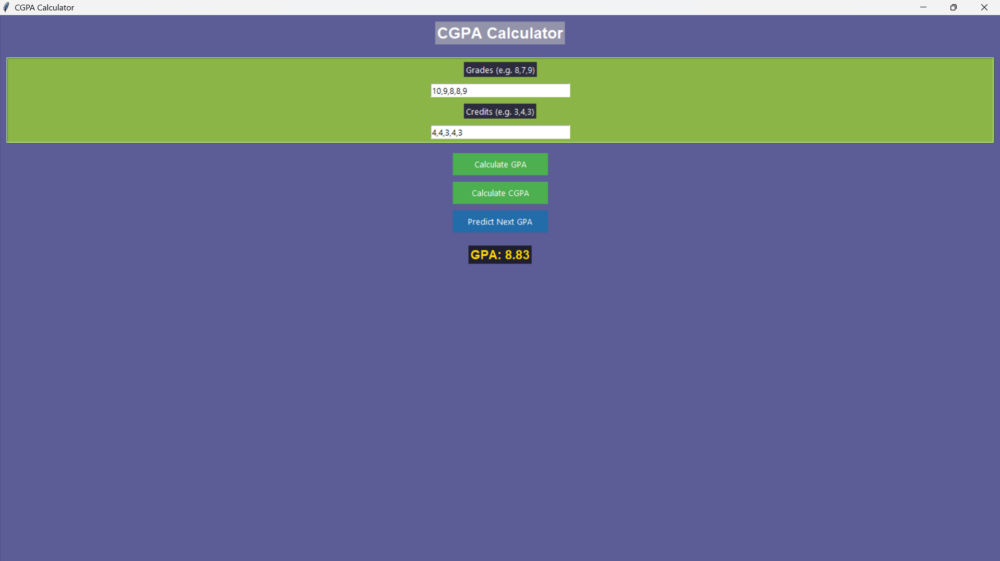

**Name: DHANESHKUMAR S**  
**Course: B.tech(Aerospace)**  
**Reg no: 25BAS10096**

# **CGPA Calculator with GUI and Prediction System**

## **Project Description**

The CGPA Calculator with GUI and Prediction System is a Python-based desktop application designed to help students efficiently calculate their Semester Grade Point Average (GPA), Cumulative Grade Point Average (CGPA), and predict their future academic performance. The system provides a user-friendly graphical interface developed using Tkinter, enabling users to input grades and corresponding credit values.

In addition to calculation functionalities, the application integrates a simple Machine Learning model using Linear Regression to forecast the GPA for the next semester. This predictive feature helps students analyze performance trends and plan improvements accordingly. The application is lightweight, easy to install, and suitable for educational use.

## **Objectives**

* To provide an easy-to-use GPA and CGPA calculator  
* To reduce manual calculation errors  
* To visualize academic progress across semesters  
* To implement a simple Machine Learning prediction model  
* To demonstrate integration of GUI with data analysis

## **Features**

* User-friendly Graphical User Interface (GUI)  
* Semester GPA calculation using grades and credits  
* Cumulative CGPA calculation across multiple semesters  
* Input validation with error handling  
* Lightweight and fast performance  
* No database required (in-memory calculation)

## **Technologies Used**

* Python 3.x  
* Tkinter (for GUI development)  
* NumPy (for numerical computations)  
* Scikit-learn (for Linear Regression model)

## 

## **System Requirements**

Before running the project, ensure the following are installed:

* Python 3.7 or above  
* pip (Python package manager)  
* Internet connection (only required for installing dependencies)

To check Python version:

python \--version

## **Installation Guide**

### Step 1: Clone the Repository

git clone https://github.com/your-username/CGPA-Calculator.git

### Step 2: Navigate to Project Directory

cd CGPA-Calculator

### Step 3: Install Required Dependencies

pip install numpy scikit-learn

If Tkinter is not installed:

For Windows:  
Tkinter comes pre-installed with Python.

For Ubuntu/Linux:sudo apt-get install python3-tk

For macOS:

brew install python-tk

## **How to Run the Application**

After installation, run the following command:

python cgpa\_calculator.py

The GUI window will open automatically.

---

## **How to Use the Application**

### **Step 1: Enter Grades**

Enter grades separated by commas.  
Example:8,7,9,8

### **Step 2: Enter Credits**

Enter corresponding credits separated by commas.  
Example:3,4,3,2

### **Step 3: Calculate GPA**

Click **Calculate GPA** to compute semester GPA.

### **Step 4: Calculate CGPA**

Click Calculate CGPA to compute overall CGPA based on all entered semesters.

## **GPA Calculation Method**

The Semester GPA is calculated using the weighted average formula:

GPA \= Σ (Grade × Credit) / Σ (Credits)

Where:

* Grade represents the grade point obtained  
* Credit represents subject credit value

## 

## **CGPA Calculation Method**

CGPA is calculated as the average of all semester GPAs:

CGPA \= (GPA₁ \+ GPA₂ \+ GPA₃ \+ ... \+ GPAₙ) / n

## **Project Workflow**

1. User inputs grades and credits  
2. System calculates semester GPA  
3. GPA stored in memory  
4. CGPA calculated using stored GPA values  
5. Linear Regression model trained on GPA history  
6. Next semester GPA predicted

**Future Enhancements**

* Add semester-wise data saving  
* Add graphical performance charts  
* Export results to PDF or Excel  
* Add subject-wise grade input fields  
* Support for different grading systems

**Program output**

